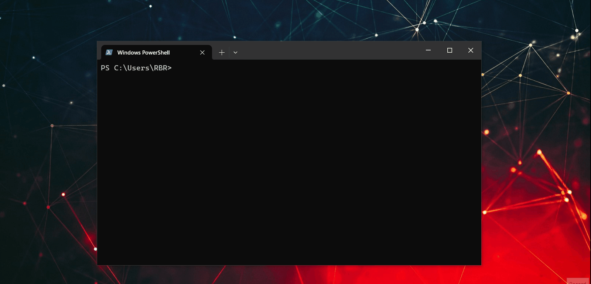
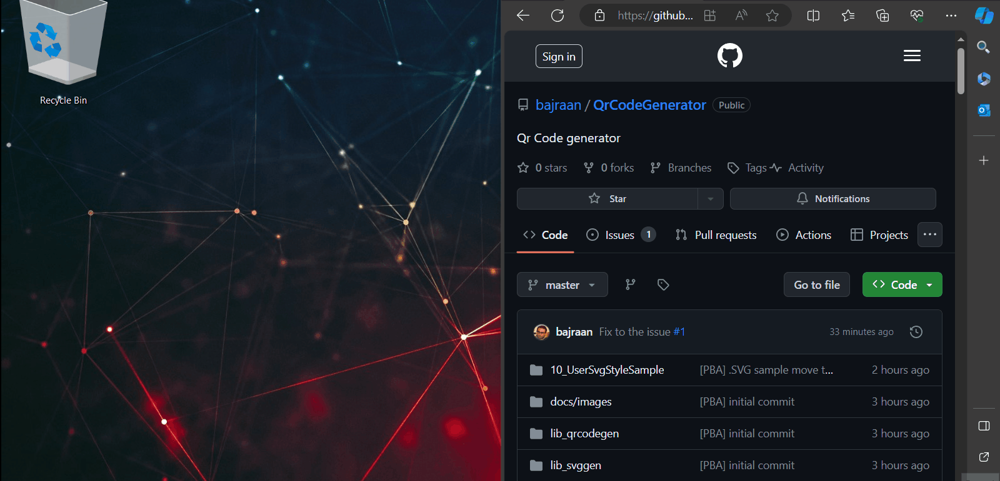
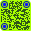

<!-- Begin README -->

> [!CAUTION]
> README.md file under heavy construction. Please do not use this file if you see this alert. The information contained in this file may be misleading. Kindly wait for updates.

<div align="center">
    
</div>
<br>
<p align="center">
    <a href="https://daringfireball.net/projects/markdown/"></a>
    <br>
    <a href="https://github.com/bajraan"></a>
    <br>
    <a href="mailto:bajran1616@gmail.com"></a>
    <br>
</p>

---------------
> [!NOTE]  
> This project is written for learning purposes. It is a library designed for generating QR codes and exporting them using specified design styles to .svg files.

> [!NOTE]  
> This project is written for learning purposes. It is a library designed for generating QR codes and exporting them using specified design styles to .svg files.
> This repository has been designed based on nayuki/QR-Code-generator project.
> Project contains two library and single demo .cpp file. Location lib_qrcodegen contains orginal not modified files from nayuki. Location liv_sbggen contains newly designed library to export qrcode objects to svg files
> Folder lib_qrcodegen contains orginal not modified files from nayuki. 
---------------

### Introduction
### Example enviroment to run project

<div align="center">
    
</div>

### Download and build

<div align="center">
    
</div>

### Build project

### lib_qrcodeqen example
### lib_svggen example
### List of QR-Code style examples

<br>
<div align="center">
    
</div>

```cpp
// CIS-CIE-CIE-4-1		
st.bodystyle     = SvgData::body::CIRCLES;
st.eyeballstyle  = SvgData::eyeball::CIRCLE;
st.eyeframestyle = SvgData::eyeframe::CIRCLE;
sc.background = "AAFF00";
sc.body = "011620";
sc.eyeball = "1010FF";
sc.eyeframe = "0116AA";
cornerradius = 4;
border = 1;	
```

<br>
<div align="center">
    
</div>

```cpp
// SQU-CIE-CIS-4-2
st.bodystyle     = SvgData::body::SQUARE;
st.eyeballstyle  = SvgData::eyeball::CIRCLE;
st.eyeframestyle = SvgData::eyeframe::CIRCLES;
sc.background = "ffee00";
sc.body = "bc0068";
sc.eyeball = "bc0068";
sc.eyeframe = "fb00ff";
cornerradius = 4;
border = 2;	
```

<br>
<div align="center">
    
</div>

```cpp
// ROD-CIR-ROD-4-2
st.bodystyle     = SvgData::body::ROUNDED;
st.eyeballstyle  = SvgData::eyeball::ROUNDED;
st.eyeframestyle = SvgData::eyeframe::ROUNDED;
sc.background = "270065";
sc.body = "d4ff00";
sc.eyeball = "ff0000";
sc.eyeframe = "ff0000";
cornerradius = 4;
border = 2;	
```
---------------

> [!NOTE]  
> This all examples may be found in QrCodeGeneratorDemo.cpp. They are genereted using demo fucntion called: doMarkdownExamples()

> [!CAUTION]
> README.md file under heavy construction. Please do not use this file if you see this alert. The information contained in this file may be misleading. Kindly wait for updates.

### Alerts

GitHub Flavored Markdown supports alerts that can be used to highlight important information:

```markdown
  > [!NOTE]  
  > Highlights information that users should take into account, even when skimming.

  > [!TIP]
  > Optional information to help a user be more successful.

  > [!IMPORTANT]  
  > Crucial information necessary for users to succeed.

  > [!WARNING]  
  > Critical content demanding immediate user attention due to potential risks.

  > [!CAUTION]
  > Negative potential consequences of an action.
```

> [!NOTE]  
> Highlights information that users should take into account, even when skimming.

> [!TIP]
> Optional information to help a user be more successful.

> [!IMPORTANT]  
> Crucial information necessary for users to succeed.

> [!WARNING]  
> Critical content demanding immediate user attention due to potential risks.

> [!CAUTION]
> Negative potential consequences of an action.

### License

This project is released under the terms of the **MIT License**, which permits use, modification, and distribution of the code, subject to the conditions outlined in the license.
- The [MIT License](https://choosealicense.com/licenses/mit/) provides certain freedoms while preserving rights of attribution to the original creators.
- For more details, see the [LICENSE](LICENSE) file in this repository. in this repository.

---------------
### License
<p align="center">
    <a href="https://github.com/nayuki/QR-Code-generator"></a><br>
    <a href="hhttps://github.com/scottgriv/markdown-demo"></a>
    <br>
</p>


> [!CAUTION]
> README.md file under heavy construction. Please do not use this file if you see this alert. The information contained in this file may be misleading. Kindly wait for updates.

<!-- End README -->
